# PHASE 3: Continuous Machine Learning (CML) & Deployment

## 1. Continuous Integration & Testing
- [ ] **1.1 Unit Testing with pytest**
  - [ ] Test scripts for data processing, model training, and evaluation
  - [x] Documentation of the testing process and example test cases

### How to run unit tests
```bash
### First, navigate to root directory of repo

# Install pytest (if not already installed)
pip install pytest

# Run pytest for all written unit tests
pytest
```

- [x] **1.2 GitHub Actions Workflows**
  - [x] CI workflows for running tests, DVC, code checks (e.g., ruff), Docker builds
  - [x] Workflow YAML files included
- [x] **1.3 Pre-commit Hooks**
  - [x] Pre-commit config and setup instructions

```bash
### Pre-commit Hooks Setup & Usage

# Install pre-commit
pip install pre-commit
- Tool to manage git hooks that run automatically before commits.

# Create .pre-commit-config.yaml in project root
- Lists hooks to run, their versions, and repositories.

Included hooks:
black: Auto-formats Python code for consistent style.
mypy: Static type checking to catch errors early.
ruff: Fast linter and autofixer, replaces flake8 for speed and power.
end-of-file-fixer: Ensures files end with a newline (POSIX standard).
trailing-whitespace: Removes trailing spaces to keep code clean.
flake8 (commented): Commented (replaced by ruff, because it was slower and less powerful than ruff)


# Install hooks to Git
pre-commit install
- Hooks run automatically before every commit.

# Run hooks on all files initially
pre-commit run --all-files
- Fixes existing issues across the codebase.
```

## 2. Continuous Docker Building & CML
- [x] **2.1 Docker Image Automation**
  - [x] Automated Docker builds and pushes (GitHub Actions)
  - [x] Dockerfile and build/push instructions for Docker Hub and GCP Artifact Registry
- [x] **2.2 Continuous Machine Learning (CML)**
  - [x] CML integration for automated model training on PRs
  - [x] Example CML outputs (metrics, visualizations)
  - [x] Setup and usage documentation

```bash
### CML Setup & Usage

# Create the Workflow Directory
mkdir -p .github/workflows
- This creates the necessary folder structure for your GitHub Actions workflows.

# Create the CML Workflow File
nano .github/workflows/cml.yaml
- We can use a text editor (like nano or vim) to create your workflow file. The above shows how to do it using Nano.

# Paste your desired CML workflow YAML to nano
- After pasting the content:
Press Ctrl + O, then Enter to save
Press Ctrl + X to exit the editor
```
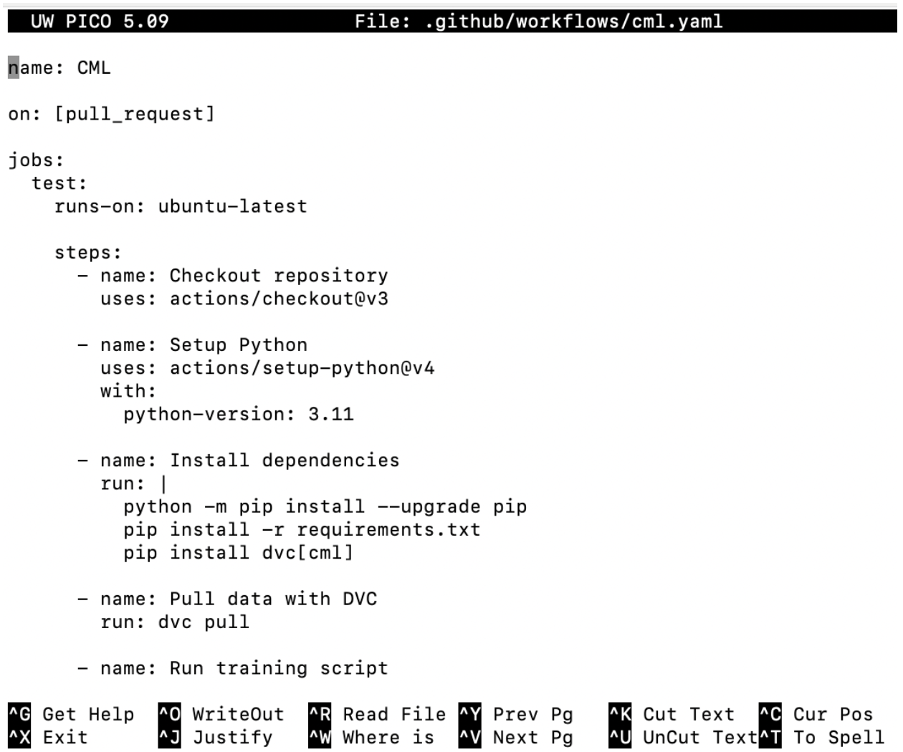 

## 3. Deployment on Google Cloud Platform (GCP)
- [x] **3.1 GCP Artifact Registry**
  - [x] Steps for creating and pushing Docker images to GCP

```bash
# Deployment Command Reference: Image Captioning with FastAPI + Cloud Run

## 1. Navigate to the Project Directory
cd "C:\Artificial inteligence\image_caption"

## 2. Build Docker Image
docker build -t image-caption-model -f dockerfiles/main.dockerfile .

## 3. Tag Docker Image for Google Artifact Registry
docker tag image-caption-model us-central1-docker.pkg.dev/dvc-drive-459219/image-captioning-repo/image-caption-model

## 4. Push Docker Image to Google Artifact Registry
docker push us-central1-docker.pkg.dev/dvc-drive-459219/image-captioning-repo/image-caption-model

## 5. Deploy Container to Google Cloud Run
gcloud run deploy image-caption-service ^
  --image=us-central1-docker.pkg.dev/dvc-drive-459219/image-captioning-repo/image-caption-model ^
  --platform=managed ^
  --region=us-central1 ^
  --allow-unauthenticated ^
  --timeout=900 ^
  --memory=2Gi

## 6. Test the API
# Swagger UI:
https://image-caption-service-xxxxx.a.run.app/docs

# API Endpoint with Curl:
curl -X POST https://image-caption-service-xxxxx.a.run.app/predict ^
  -H "accept: application/json" ^
  -H "Content-Type: multipart/form-data" ^
  -F "file=@your_image.jpg"

## Optional: Clean Up to Avoid Charges
# Delete Cloud Run Service
gcloud run services delete image-caption-service --platform=managed --region=us-central1

# Delete Docker Image from Artifact Registry
gcloud artifacts docker images delete ^
  us-central1-docker.pkg.dev/dvc-drive-459219/image-captioning-repo/image-caption-model ^
  --delete-tags --quiet

## Optional: Gradio Local Demo
pip install gradio tensorflow Pillow
python gradio_app.py

# Access in Browser:
http://127.0.0.1:7860
```

- [x] **3.2 Custom Training Job on GCP**
  - [x] Vertex AI/Compute Engine job setup and documentation
  - [x] Data storage in GCP bucket

The following items verify that the Docker image has been created and pushed to GCP
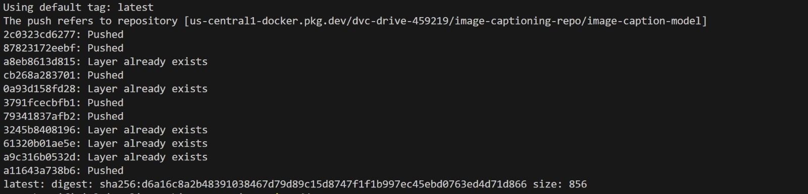 
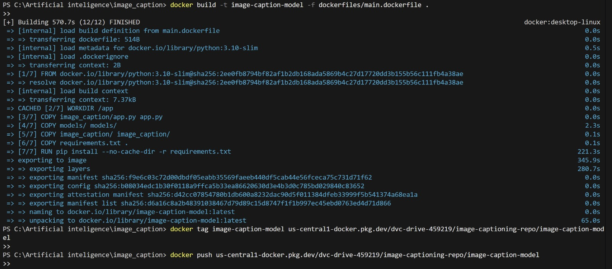 

- [x] **3.3 Deploying API with FastAPI & GCP Cloud Functions**
  - [x] FastAPI app for model predictions
  - [x] Deployment steps and API testing instructions

API request handles image uploads
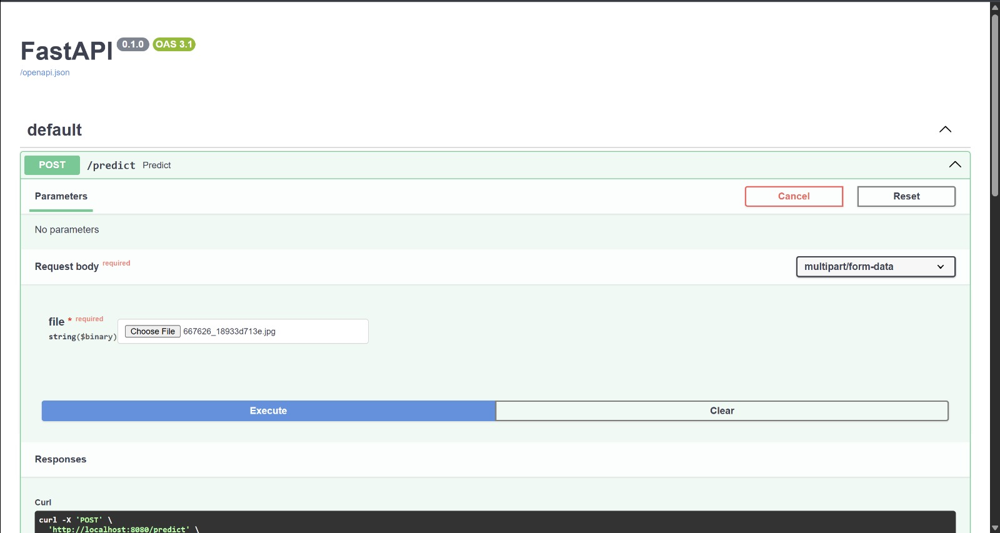 

The response where the generated caption is written
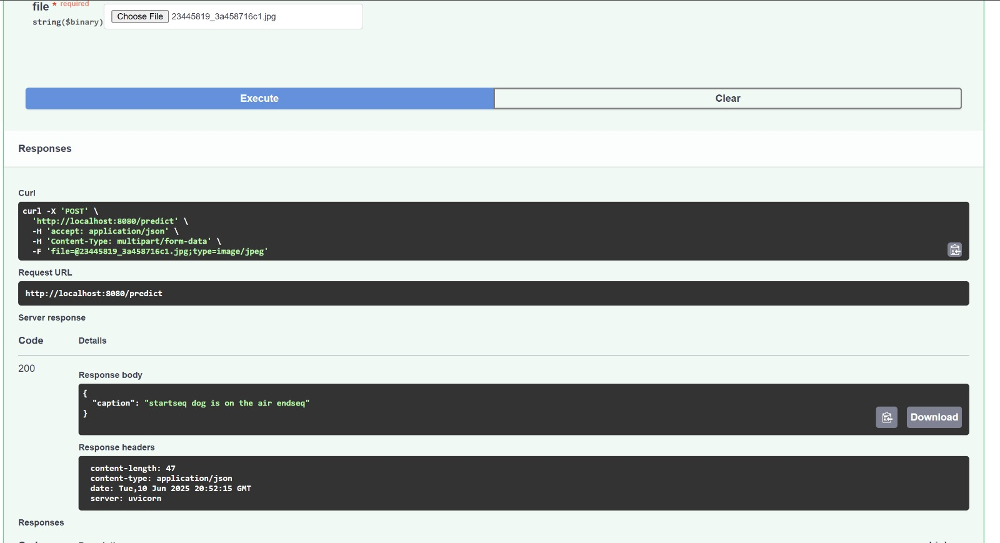 

The message indicates whether we received a response or not. Since the status is 'OK', it means it's working.
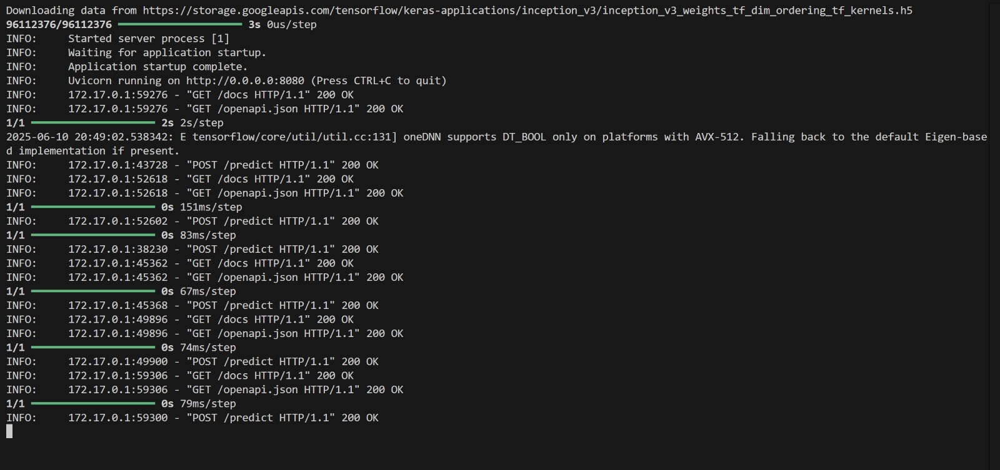 

- [x] **3.4 Dockerize & Deploy Model with GCP Cloud Run**
  - [x] Containerization and deployment steps
  - [x] Testing and result documentation

Terminal output showing successful model deployment via Google Cloud SDK.
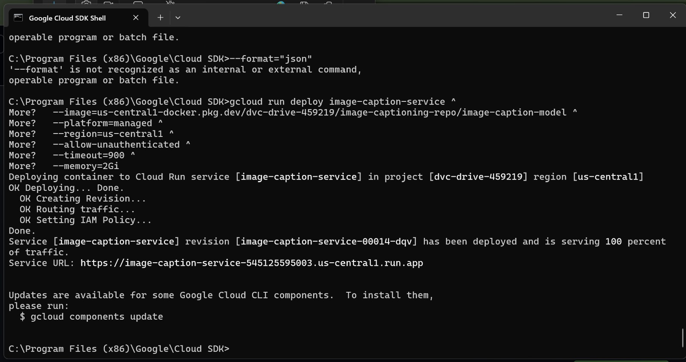 

This setup replicates the local version but is now hosted on the live server after deployment.
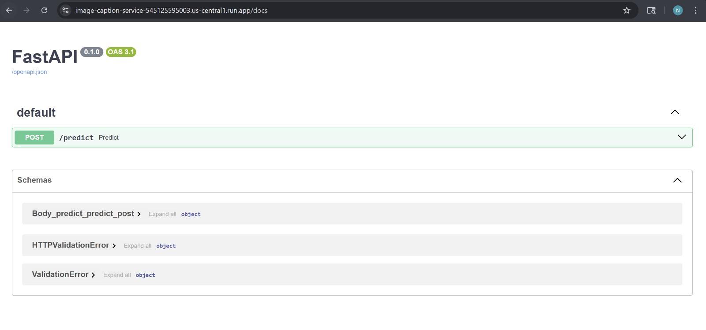 

This is the response containing the caption generated from the provided image.
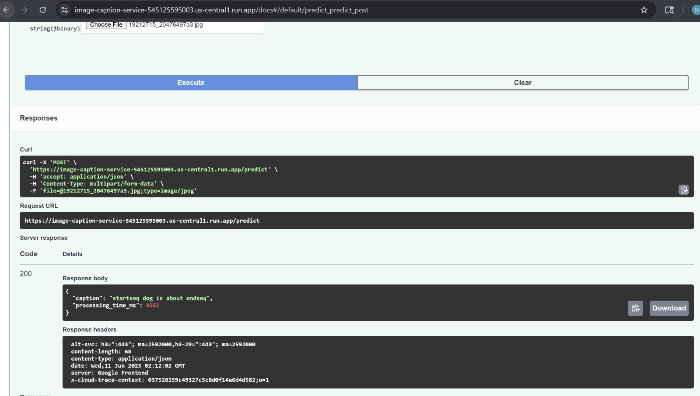 

The following three screenshots from the Google project demonstrate that the deployment is running successfully.
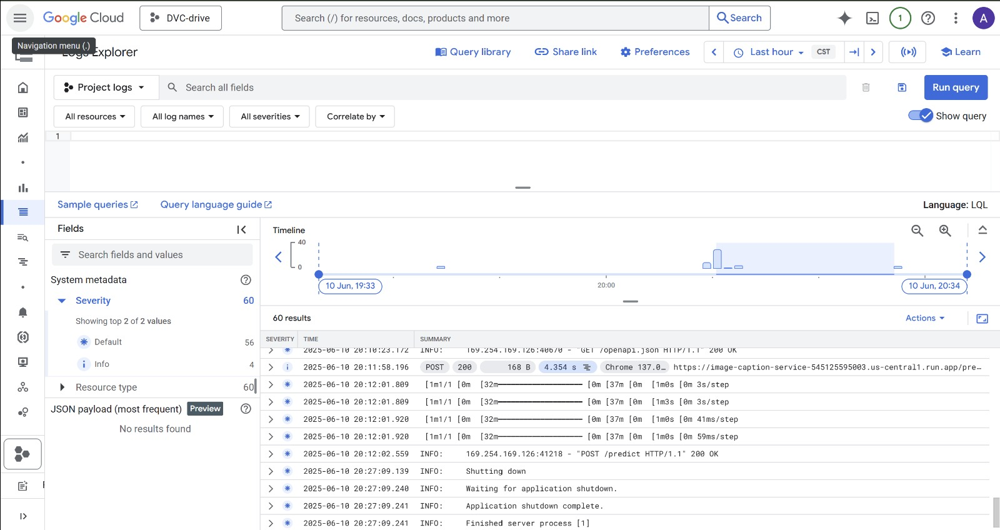 

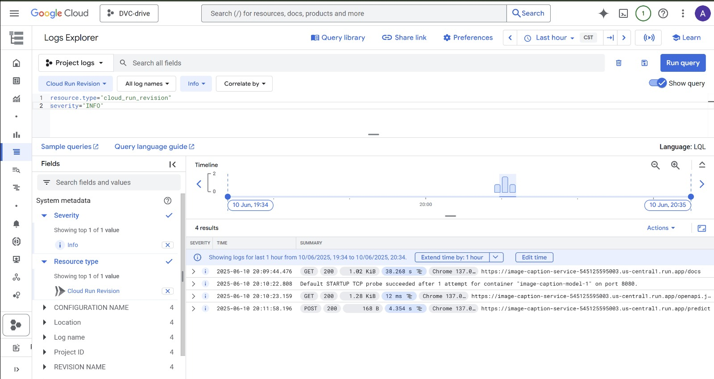 

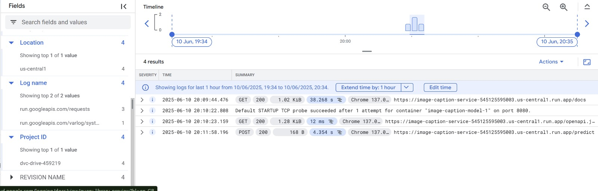 

- [x] **3.5 Interactive UI Deployment**
  - [x] Streamlit or Gradio app for model demonstration
  - [x] Deployment on Hugging Face platform
  - [x] Integration of UI deployment into GitHub Actions workflow
  - [x] Screenshots and usage examples

We built a simple Gradio app to try out our image captioning model. You can upload a picture on the local web page, and the app will show a caption it generates. It uses a model with InceptionV3 to understand the image and create captions. The app runs on your computer at http://127.0.0.1:7860. It’s great for quick testing or showing others how the model works.

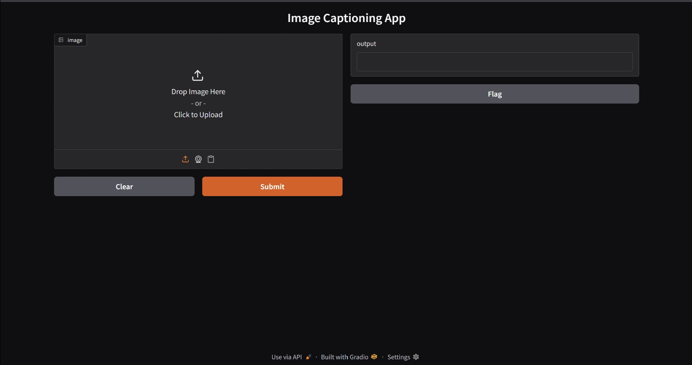 
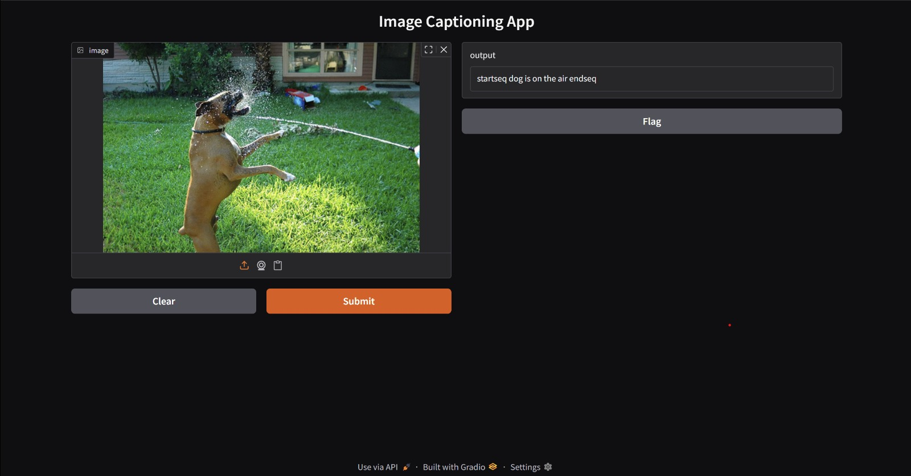 

## 4. Documentation & Repository Updates
- [x] **4.1 Comprehensive README**
  - [x] Setup, usage, and documentation for all CI/CD, CML, and deployment steps
  - [x] Screenshots and results of deployments
- [x] **4.2 Resource Cleanup Reminder**
  - [x] Checklist for removing GCP resources to avoid charges

> **Checklist:** Use this as a guide for documenting your Phase 3 deliverables. Focus on automation, deployment, and clear, reproducible instructions for all steps.
