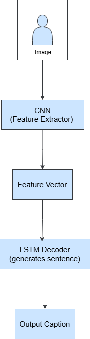

# Image Captioning Project 🖼️ 
 
## 1. Overview 🧠 
 
The project aims to develop a model for captioning images from scratch. Behind the project two main technologies are utilized: Convolutional Neural Network (CNN) and Long Short-Term Memory (LSTM). While CNN focuses on extracting image features, LSTM serves for generating captions. Flickr8k dataset is utilized for training the model. The dataset consists of 8000 images, and each image contains 5 various caption choices. Shortly, the purpose of the project is to create descriptive and meaningful captions for images by effectively integrating text data into image data. 
 
### 1.1 Environment Setup ⚙️ 
 
To set up the model, you are required to install all the certain libraries and dataset. 
 
Make sure that all the essential tools and libraries are successfully imported into the environment. The technologies you need are as follows: 
 
- **Language**: Python 3.6+ 
- **Neural Network Operations**: TensorFlow or Keras 
- **Data Manipulation and Visualization**: NumPy, Matplotlib, and PIL 
 
### 1.2 Explore the Flickr8k Dataset 🗂️ 
 
The Flickr8k Dataset contains image-caption pairs. All captions are kept in a text document and linked to images through a dictionary using a mapping structure for future training needs and activities. This dataset was sourced from [Kaggle](https://www.kaggle.com/datasets/adityajn105/flickr8k). 
 
### 1.3 Data Preprocessing 🧹 
 
**Image Preprocessing:** 
- Adjusting each image to 224x224 pixels 
- Scaling pixel values to make data ready for CNN input 
 
**Text Preprocessing:** 
- Transforming all characters in the captions to lowercase 
- Cleaning any unnecessary spaces and punctuation symbols 
- Introducing special tokens-markers to identify ending and starting points of captions 
- `startseq` – beginning of a caption 
- `endseq` – ending of a caption 
- Splitting captions into individual tokens to generate a vocabulary of distinct words in the dataset 
- Determining the maximum length of captions to guide padding alignment 
 
--- 
 
## 2. Methodology 🧪 
 
### 2.1 Designing and Implementing the CNN 🧱 
 
The CNN model is designed to extract features from images. Its architecture consists of different layers which have own responsibilities and jobs: 
 
- **Input Layer**: Receives input images with size (224, 224, 3) 
- **Convolutional Layers**: A series of convolutional layers, each using ReLU activations and progressively growing filter sizes (e.g., from 32 to 128) 
- **Pooling Layers**: MaxPooling layers are used after each convolutional layer to reduce the spatial dimensions 
- **Flatten Layer**: Flattens 2D feature maps into a 1D feature vector 
- **Dense Layer**: A fully connected layer with a reduced number of units (e.g., 256) using ReLU activation 
- **Dropout Layer**: During training, it sets certain units to zero to avoid overfitting 
 
### 2.2 Testing the CNN with Sample Images 🖼️ 
 
Once the CNN is created, a sample image is passed through the model to ensure that everything works properly, and the generated feature vector matches with expected results. 
 
### 2.3 Preparing Textual Data 📝 
 
**Sequence Creation:** 
- For each caption, input-output pairs are produced to train a model. While the input takes up a part of the sentence, the output carries the next word that should come after the previous part. 
 
**Padding:** 
- To ensure max length sequences are extended with filler values (paddings) 
 
**One-Hot Encoding:** 
- Each word in the captions is encoded into one-hot format to be compatible with the LSTM 
 
### 2.4 Designing the LSTM Architecture 🔄 
 
The LSTM architecture plays the role of the decoder in the model: 
 
- **Image Feature Input**: The CNN features are forwarded into a dense layer 
- **Caption Input**: Sequences are converted into dense vector formats 
- **LSTM Layer**: LSTM processes the encoded sequences 
- **Merging Paths**: The LSTM output is merged with the processed image features 
- **Dense Layers**: The merged features are fed into dense layers using ReLU activation 
- **Output Layer**: Using the softmax activation function next word in the caption is predicted 
 
### 2.5 Preparing Training Data 🧰 
 
**Feature Extraction**: CNN analyzes all images; extracts needed features and saves them in a dictionary 
 
**Creating Sequences**: For each image, input-output combinations are created along with their matching captions: 
 
- **Image Features (X1)**: Extracted image features 
- **Input Sequences (X2)**: Segment of the caption sequence 
- **Output Words (y)**: One-hot representation of the next word 
 
## 3. System Design Structure Overview 🖼️ 
 
The visual representation of the components below illustrates how they work together in this image captioning project: 
 
 
 
The project consists of three different phases. The roadmap for each phase is described in detail, with clear instructions provided separately. By visiting each link below, you can easily follow the phases: 
[PHASE1.md](./PHASE1.md) 
[PHASE2.md](./PHASE2.md) 
[PHASE3.md](./PHASE3.md) 